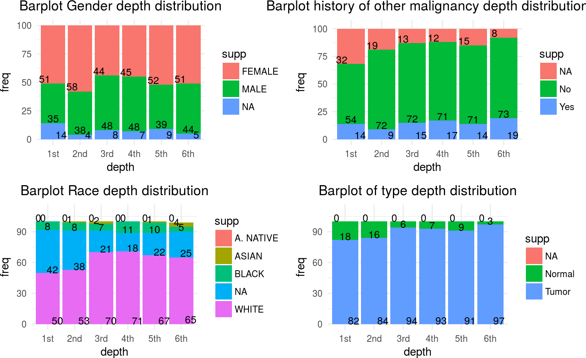

# Introduction
The lung adenocarcinoma cancer is the most common type of lung cancer. It has a high incidence in the population and also an associated high mortality @Collisson2014. That’s because nowadays this cancer is really hard to diagnose in its early steps and usually is found too late @Giordano2018. Most of the previous studies aim to find genetic markers to be able to diagnose it in its stages. Although some genetic markers have been described and used, such as the mutation in the Kran gene, but more information is required @Inamura2018.

Here in this project, the data of the TCGA project will be analyzed with the aim to find (and reproduce) the finding of differential expressed genes that could help to detect this kind of cancer @Collisson2014.

# Quality assessment

## Data description

The data obtained for this project comes from The Cancer Genome Atlas (TCGA). This data contains lung cancer gene expression information of both patients and healthy individuals (control).


```r
se <- readRDS( "seLUAD.rds")
se
```

```
## class: RangedSummarizedExperiment 
## dim: 20115 600 
## metadata(5): experimentData annotation cancerTypeCode
##   cancerTypeDescription objectCreationDate
## assays(1): counts
## rownames(20115): 1 2 ... 102724473 103091865
## rowData names(3): symbol txlen txgc
## colnames(600): TCGA.05.4244.01A.01R.1107.07
##   TCGA.05.4249.01A.01R.1107.07 ... TCGA.91.6847.11A.01R.1949.07
##   TCGA.91.6849.11A.01R.1949.07
## colData names(549): type bcr_patient_uuid ...
##   lymph_nodes_aortic_pos_by_ihc lymph_nodes_aortic_pos_total
```

The first step is to import and check the provided data and it’s associated metadata. In summary it contains 600 Samples and 549 Clinical variables. Each  one of those samples contains information about the expression of 20115 genes.


```r
dim(colData(se))
```

```
## [1] 600 549
```

```r
dim(rowData(se))
```

```
## [1] 20115     3
```

From the Clinical variables, the ones that were found to be interesting and, then, were further analyzed were:

* Gender (Sex)
* Race (Ethnicity)
* History of other malignancy (if the patient had previous cases of cancer malignancy)
* Type (If the sample is normal or a tumor)
* Histologic Diagnosis (Information about the histological origin of the sample)

Also, each sample’s name from the TCGA contains important information that was also taken into account. The information extracted from the sample was:

* Tissue Source Site
* Sample Vial
* Sample Plate


```r
mcols(colData(se), use.names=TRUE)
```

```
## DataFrame with 549 rows and 2 columns
##                                                          labelDescription
##                                                               <character>
## type                                           sample type (tumor/normal)
## bcr_patient_uuid                                         bcr patient uuid
## bcr_patient_barcode                                   bcr patient barcode
## form_completion_date                                 form completion date
## prospective_collection            tissue prospective collection indicator
## ...                                                                   ...
## lymph_nodes_pelvic_pos_total                               total pelv lnp
## lymph_nodes_aortic_examined_count                           total aor lnr
## lymph_nodes_aortic_pos_by_he                          aln pos light micro
## lymph_nodes_aortic_pos_by_ihc                                 aln pos ihc
## lymph_nodes_aortic_pos_total                                total aor-lnp
##                                         CDEID
##                                   <character>
## type                                       NA
## bcr_patient_uuid                           NA
## bcr_patient_barcode                   2673794
## form_completion_date                       NA
## prospective_collection                3088492
## ...                                       ...
## lymph_nodes_pelvic_pos_total          3151828
## lymph_nodes_aortic_examined_count     3104460
## lymph_nodes_aortic_pos_by_he          3151832
## lymph_nodes_aortic_pos_by_ihc         3151831
## lymph_nodes_aortic_pos_total          3151827
```

To perform quality assessment and normalization the 'DGEList' object from [edgeR](http://bioconductor.org/packages/edgeR) R/Bioconductor package will be used.


```r
dge_luad <- DGEList(counts = assays(se)$counts, genes = as.data.frame(mcols(se)), group = se$type)
```

$\log_2$ CPM values of expression are calculated as an additional assay element to ease their manipulation.


```r
CPM <- t(t(dge_luad$counts)/(dge_luad$samples$lib.size/1e+06))
assays(se)$logCPM <- cpm(dge_luad, log = TRUE, prior.count = 0.25)
assays(se)$logCPM[1:3, 1:7]
```

```
##   TCGA.05.4244.01A.01R.1107.07 TCGA.05.4249.01A.01R.1107.07
## 1                    0.2447528                     2.970330
## 2                    9.1576711                    10.647705
## 9                   -7.3119529                    -7.311953
##   TCGA.05.4250.01A.01R.1107.07 TCGA.05.4382.01A.01R.1206.07
## 1                     1.760084                     3.131135
## 2                     9.968513                    10.434594
## 9                    -7.311953                    -7.311953
##   TCGA.05.4384.01A.01R.1755.07 TCGA.05.4389.01A.01R.1206.07
## 1                     3.061817                     1.958342
## 2                    11.556098                     8.879085
## 9                    -7.311953                    -7.311953
##   TCGA.05.4390.01A.02R.1755.07
## 1                     3.306361
## 2                     9.741797
## 9                    -7.311953
```

The first  important step of this project is the assessment of the quality of the provided data. For this reason, the following analysis aims to find and correct possible errors that the data could have, such as batch effect, lack of homogeneity, possible confounding factors and source of noise (very low expressed genes).

## Sequencing depth

The first step of the quality assessment involves checking the sequencing depth of the samples. The aim of this step is to verify that all the sample groups were sequenced with the same depth distribution, and to detect if any sample group, according to each clinical variable of interest, was poorly sequenced (to see if any clinical variable has had an effect on the sequencing process).

<div class="figure">

<p class="caption">(\#fig:libsizes)Library sizes in increasing order.</p>
</div>

As the number of samples is huge, a bar for each sample will be not useful because the bar would be too small for the human eye. For this reason, a different approach was taken. This approach consists of clustering the samples with similar sequencing depth and then showing a bar plot of the clusters. If the bar plots of each level (category) of the corresponding analyzed clinical variable has the same height in each of the clusters, that means that the sequencing was homogeneous for that level.

<div class="figure">

<p class="caption">(\#fig:custombarplot)Quantile barplot of lib sizes classified by factor</p>
</div>

This figure reveals substantial differences in sequencing depth between samples
and we may consider discarding those samples whose depth is substantially lower
than the rest. To identify who are these samples we may simply look at the
actual numbers including portion of the sample identifier that distinguishes them.


```r
sampledepth <- round(dge_luad$sample$lib.size / 1e6, digits=1)
names(sampledepth) <- substr(colnames(se), 6, 12)
head(sort(sampledepth))
```

```
## 44.2665 44.2662 62.8397 44.6147 62.A470 44.6775 
##     6.4    12.6    13.2    13.6    13.8    14.1
```

In general, the plots of all the clinical variables showed more or less  a similar sequencing depth distribution. However, in the bar plot of the clinical variable “Type”, the plot looked a little bit odd as it seems that the normal samples were in general sequenced with less depth than the tumor ones. This is important to take into account as the final objective of this project is to check for differential expression. Unfortunately, those samples cannot be removed because they are necessary to check the differences in gene expression of healthy and cancer tissues.

## Distribution of expression levels by sample

The next step is to verify the expression levels among the samples. With this analysis we can check if any sample had an unusual expression profile. The best case scenario would be that all the samples showed a similar profile, meaning that all the samples were correctly collected. 
Because of the huge amount of samples, they will be analyzed in two plots, one for the tumor ones and other for the healthy or normal ones.

<div class="figure">

<p class="caption">(\#fig:distRawExp)Non-parametric density distribution of expression profiles per sample.</p>
</div>

The results of the plots are as expected since all the samples showed a similar bimodal profile, with some density of low or non expressed genes (first peak) and some density of more expressed genes (second peak). Since no sample has had an odd expression level profile, none of them has been removed.

## Distribution of expression among genes

As it has been observed in the previous analysis, some genes seemed to have really low expression values between samples. Now, it’s interesting to see if there is any gene that is systematically lowly expressed in all the samples because that would mean that it is not a relevant gene and could lead to false positives if analyzed (small differences in low expressed genes can seem statistically significant when they are probably caused by noise). 

To check the average expression of each gene across samples, the average expression of each gene was plotted in an histogram.

<div class="figure">

<p class="caption">(\#fig:exprdist)Distribution of average expression level per gene.</p>
</div>

The histogram shows that there are in fact some systematically lowly expressed genes that should be removed. To filter out those genes, two cut-off values were used: the first one entailed a minimum CPM value accepted (obtained from: Minimum logCPM = 10/minimum depth). After deleting the genes that did not pass the first cut-off another filter step was applied. This filter step involved removing the genes that, because of the first cut-off step, had less samples than the smallest gene group (which in this case is the normal group, with 59 samples). 


```r
cpmcutoff <- round(10/min(dge_luad$sample$lib.size/1e+06), digits = 1)
cpmcutoff
```

```
## [1] 1.6
```

```r
nsamplescutoff <- min(table(se$type))
nsamplescutoff
```

```
## [1] 59
```

```r
mask <- rowSums(cpm(dge_luad) > cpmcutoff) >= nsamplescutoff

se.filt <- se[mask, ]
dge_luad.filt <- dge_luad[mask, ]
dim(se.filt)
```

```
## [1] 14146   600
```

The results of the previous filtering are represented in the same histogram plot with red bars. These are the genes that passed the whole filtering process.

At the beginning, we had 20115 different genes but after the filtering of the low expressed ones, 14146 remained.

<div class="figure">

<p class="caption">(\#fig:filtexprdist)Distribution of average expression level of filtered and non filtered genes.</p>
</div>

## Normalization

One vital step is the quantile normalization, which is needed because, after sequencing, we obtain a given number of total reads that is fixed by the experiment procedure.
This means that the counts observed for each gene are restricted by the total amount of reads, so if a sample has more expressed genes than another one with the same amount of reads, the numbers will not be equivalent and thus not comparable. ( Two genes equally expressed in two different samples can have different values of counts if one of those samples has more expressed genes than the other one).


```r
dge_luad.filt <- calcNormFactors(dge_luad.filt, normalize.method="quantile")
```

To see how this normalized step has affected to the expression levels of our data, two vuvuzella plots have been made, one with the non-filtered non-normalized data (left) and the other with the normalized and filtered one (right). As we can see, the differences are not really high which means that the data still has lots of variability.

<div class="figure">

<p class="caption">(\#fig:vuvuprefilt)Vuvuzela plots</p>
</div>

After the normalization, the bulk of the difference of the mean expression between tumor and normal samples was closer to 0. This indicates that the process was done correctly since we expect that most of the genes are not differential expressed (so the bulk of the mean should be close to 0).

## MA-plots

The objective of this set of plots is to see if any sample has an expression profile that is different from the rest of the samples. As the genes with differential expression should be few, the majority of genes should have an expression level similar to the average expression for that gene. So, in summary, most of the points should be around 0 (no difference).

The profiles for all the samples were observed. However, due to the huge amount of samples, only 50 of the two important groups ( tumor and normal) are shown.

<div class="figure">

<p class="caption">(\#fig:maPlots)MA-plots of some tumor(blue) and normal(green) samples.</p>
</div><div class="figure">

<p class="caption">(\#fig:maPlots)MA-plots of some tumor(blue) and normal(green) samples.</p>
</div>

The result doesn’t show expression-level dependent biases among the samples, so no sample needs to be removed.

## Variability and batch identification

### Check sources of cofounding variability

To begin with, a MDS plot was done to check which is the main source of variability of our data.

<div class="figure">

<p class="caption">(\#fig:firstmds)MDS preprocessed</p>
</div>

As expected, the main source of variability is the difference between tumor and normal samples.
In addition, after doing the plot, two possible outliers were detected. These are 
TCGA.64.5775.01A.01R.1628.07 and perhaps TCGA.49.AAR9.01A.21R.A41B.07 samples. 
These two samples will not be removed yet but they will be examined with detail in further analysis.

#### Identifying batch effect variables

The variables in which the batch effect will be checked are the following:


```r
tss <- substr(colnames(se.filt), 6, 7)
center <- substr(colnames(se.filt), 27, 28)
plate <- substr(colnames(se.filt), 22, 25)
portionanalyte <- substr(colnames(se.filt), 18, 20)
samplevial <- substr(colnames(se.filt), 14, 16)
gender <- unname(se.filt$gender)
race <- unname(se.filt$race)
histo <- unname(se.filt$histologic_diagnosis.1)
```

In order to check possible batch effects in the clinical variables of interest, cross tabulation tables were performed.


```r
table(data.frame(TYPE=se.filt$type, TSS=tss))
```

```
##         TSS
## TYPE     05 35 38 44 49 4B 50 53 55 62 64 67 69 71 73 75 78 80 83 86 91 93
##   normal  0  0  4 17  7  0  8  0 15  0  0  0  0  0  1  0  0  0  0  0  7  0
##   tumor  34  4 11 69 29  1 33  4 91 16 12  9 15  2 12 16 33  3  1 34 16  7
##         TSS
## TYPE     95 97 99 J2 L4 L9 MN MP NJ O1 S2
##   normal  0  0  0  0  0  0  0  0  0  0  0
##   tumor  12 25  6  5  2  7  3 18  9  1  1
```

```r
# Too much zeros. Only six TSS have noral samples

table(data.frame(TYPE=se.filt$type, TSS=samplevial))
```

```
##         TSS
## TYPE     01A 01B 01C 02A 11A 11B
##   normal   0   0   0   0  58   1
##   tumor  524  14   1   2   0   0
```

```r
# hey batch effect!!

table(data.frame(TYPE=se.filt$type, PLATE=plate))
```

```
##         PLATE
## TYPE     0946 1107 1206 1628 1755 1758 1858 1949 2039 2066 2090 2170 2187
##   normal    0    0    0    3    6   11   21   18    0    0    0    0    0
##   tumor    21   11   35   26   41    0   37   33   33   28    2   22   18
##         PLATE
## TYPE     2241 2287 2326 2403 A24H A24X A262 A277 A278 A39D A41B A466
##   normal    0    0    0    0    0    0    0    0    0    0    0    0
##   tumor    35   17   14   34   32   34   20   12   12   13    9    2
```

```r
# Too much zeros: only 5 plates with normal. 
# One of the plates (1758) only has normals!!!

table(data.frame(TYPE=se.filt$type, PORTIONALYTE=portionanalyte))
```

```
##         PORTIONALYTE
## TYPE     01R 02R 04R 06R 11R 12R 21R 22R 31R 32R 41R 43R 51R
##   normal  58   1   0   0   0   0   0   0   0   0   0   0   0
##   tumor  103  14   2   4 337  22  41   6   7   2   1   1   1
```

```r
# All normal samples have extremly low values of portion analyte
# Not necessary: tumor and normal have separated values

table(data.frame(TYPE=se.filt$type, GENDER=gender))
```

```
##         GENDER
## TYPE     FEMALE MALE
##   normal     31   21
##   tumor     270  231
```

```r
#Seems pretty equilibred

table(data.frame(TYPE=se.filt$type, RACE=race))
```

```
##         RACE
## TYPE     AMERICAN INDIAN OR ALASKA NATIVE ASIAN BLACK OR AFRICAN AMERICAN
##   normal                                0     0                         0
##   tumor                                 1     8                        49
##         RACE
## TYPE     [Not Available] [Not Evaluated] [Unknown] WHITE
##   normal               0               0         0     0
##   tumor               56               6         5   376
```

```r
#Mising too much dat

table(data.frame(TYPE=se.filt$type, RACE=histo))
```

```
##         RACE
## TYPE     Lung Acinar Adenocarcinoma Lung Adenocarcinoma Mixed Subtype
##   normal                          0                                 0
##   tumor                          19                               105
##         RACE
## TYPE     Lung Adenocarcinoma- Not Otherwise Specified (NOS)
##   normal                                                  0
##   tumor                                                 308
##         RACE
## TYPE     Lung Bronchioloalveolar Carcinoma Mucinous
##   normal                                          0
##   tumor                                           5
##         RACE
## TYPE     Lung Bronchioloalveolar Carcinoma Nonmucinous
##   normal                                             0
##   tumor                                             19
##         RACE
## TYPE     Lung Clear Cell Adenocarcinoma Lung Micropapillary Adenocarcinoma
##   normal                              0                                  0
##   tumor                               2                                  3
##         RACE
## TYPE     Lung Mucinous Adenocarcinoma Lung Papillary Adenocarcinoma
##   normal                            0                             0
##   tumor                             1                            23
##         RACE
## TYPE     Lung Signet Ring Adenocarcinoma
##   normal                               0
##   tumor                                1
##         RACE
## TYPE     Lung Solid Pattern Predominant Adenocarcinoma
##   normal                                             0
##   tumor                                              5
##         RACE
## TYPE     Mucinous (Colloid) Carcinoma
##   normal                            0
##   tumor                            10
```

```r
#Mising too much dat
```

Most tables didn’t present clear results as the amount of normal samples is very low compared to the tumor ones. 
However, the sample vial variable showed clearly biased results, as all the normal samples were sequenced in different vials.

### Batch effect found in sample vial

As the sample vial variable showed a clear batch effect in the previous analysis, different batch effect removing techniques were used to decrease the impact of this batch in our data.

<div class="figure">

<p class="caption">(\#fig:samplevialdendo1)Dendogram of variation labeled by Sample Vial</p>
</div>

The figure /@ref(fig:samplevialdendo1) provides a way to graphically observe this batch effect.

The first approach used to remove the batch effect was QR-decomposition.


```
## Coefficients not estimable: batch5
```

```
## Warning: Partial NA coefficients for 14146 probe(s)
```

<div class="figure">

<p class="caption">(\#fig:samplevialdendo2)Dendogram of variation labeled by Sample Vial corrected with QR</p>
</div>

As it can be seen, this method didn't accomplish the desired effect since the batch effect is still present. Thus, a more agressive method, namely SVD batch removal, was applied:

<div class="figure">

<p class="caption">(\#fig:samplevialdendo3)Dendogram of variation labeled by Sample Vial corrected with SVD</p>
</div>

Unfortunately, after the statistical treatment the sample vial batch effect is still present. 
As the normal samples can’t be removed, both approaches will be applied simultaneously to try to remove the effect. 


```
## Coefficients not estimable: batch5
```

```
## Warning: Partial NA coefficients for 14146 probe(s)
```

<div class="figure">

<p class="caption">(\#fig:samplevialdendo4)Dendogram of variation labeled by Sample Vial corrected with SVD & QR</p>
</div>

After applying the combination of both methods the batch effect was finally removed. 
Now it’s important to check that this aggressive approach hasn’t removed the variability of our data. 
This topic will be covered in the next section

### Analysis of unclear variables 

There are variables where batch effect presence is uncertain. Thus, MDS plots were done as a graphical way to check possible batch effects.
These unclear variables were:

* Tisue source site (TSS)
* Plate
* Sex
* Ethnicity
* Histology
* Sample vial variable, which is pressumed to be associated with batch effect, was plotted as reference: 

<div class="figure">

<p class="caption">(\#fig:mdsplots1)MDS plots without batch labeled for different clinical variables</p>
</div><div class="figure">

<p class="caption">(\#fig:mdsplots1)MDS plots without batch labeled for different clinical variables</p>
</div><div class="figure">

<p class="caption">(\#fig:mdsplots1)MDS plots without batch labeled for different clinical variables</p>
</div><div class="figure">

<p class="caption">(\#fig:mdsplots1)MDS plots without batch labeled for different clinical variables</p>
</div><div class="figure">

<p class="caption">(\#fig:mdsplots1)MDS plots without batch labeled for different clinical variables</p>
</div>
It doesn't seem that there is any significant batch effect across these uncertain variables (except for sample vial, as expected). Therefore, the uncertainty observed on cross tabulation tables was due to sample size differences between normal and tumor groups.

# Differential expression

Since the main objective of this project was to find differentially expressed genes an initial rough approach is used. 
However, a more complex and detailed analysis will be performed in the second part of the project.
The most basic method to spot differential expression is to check the standard deviation of expression of each gene between samples against the mean expression. The genes with a higher standard deviation than the expected from the mean expression are the best candidates to be differentially expressed.


```r
logCPM.filt <- logCPM
logCPM.origin <- cpm(dge_luad, log=TRUE, prior.count = 3)
meanUnloggedExp.filt <- rowMeans(assays(se.filt)$counts)
sdUnloggedExp.filt <- apply(assays(se.filt)$counts, 1, sd)
meanLoggedExp.filt <- rowMeans(logCPM.filt)
sdLoggedExp.filt <- apply(logCPM.filt, 1, sd)

meanUnloggedExp <- rowMeans(assays(se)$counts)
sdUnloggedExp <- apply(assays(se)$counts, 1, sd)
meanLoggedExp <- rowMeans(logCPM.origin)
sdLoggedExp <- apply(logCPM.origin, 1, sd)
```

<div class="figure">

<p class="caption">(\#fig:DElogynormal)Scatter plot: variability vs gene expression</p>
</div>

To combine the data apported by both Standard Deviation and log mean expressions, multiple F-tests are performed (one for each gene). 


```r
mod <- model.matrix(~ se.filt$type, colData(se.filt))
mod0 <- model.matrix(~ 1, colData(se.filt))
pv <- f.pvalue(assays(se.filt)$logCPM, mod, mod0)
sum(p.adjust(pv, method = "bonferroni") < 0.01)
```

```
## [1] 8346
```

There are 11096 genes changing significantly
their expression at FDR < 1%. In Figure \@ref(fig:pdist) below  the distribution of the
resulting p-values is showed:

<div class="figure">

<p class="caption">(\#fig:pdist)Distribution of raw p-values for an F-test on every gene between tumor and normal samples.</p>
</div>

However, this kind of tests often give a lot of False Positives. Probably, most of these genes 8346 are not actually differentially expressed. Thus, we’ll use the surrogate variables (SVA) method from the R/Bioconductor package [sva](http://bioconductor.org/packages/sva) to reduce the number of differentially expressed genes.


```r
sv <- sva(assays(se.filt)$logCPM, mod, mod0)
```

```
## Number of significant surrogate variables is:  55 
## Iteration (out of 5 ):1  2  3  4  5
```

```r
sv$n
```

```
## [1] 55
```

The SVA algorithm has found 55 surrogate variables. Let's use them to
assess against the extent of differential expression this time adjusting for these
surrogate variables.


```r
modsv <- cbind(mod, sv$sv)
mod0sv <- cbind(mod0, sv$sv)
pvsv <- f.pvalue(assays(se.filt)$logCPM, modsv, mod0sv)
sum(p.adjust(pvsv, method="bonferroni") < 0.01)
```

```
## [1] 10155
```
As expected, the number of differentially expressed genes has been reduced significantly.

## Volcano Plot

Nonetheless, significance in the differential expression is not enough to provide these genes with a clinical interest. The fold change is the other factor to be noticed and it represents the magnitude of differential expression of each gene between the study groups (in this particular case tumor and normal).

The volcano plot encompasses both features, making it a perfect tool to visually understand our data. 

<div class="figure">

<p class="caption">(\#fig:volcano)Volcano plot</p>
</div>

In red, the genes that are both with significant differential expression and a high enough fold change (arbitrarily set to |2|).In conclussion, these genes are the best candidates to have a role in the malignancy of tumor cells or in some aspect of lung adenocarcinoma tumor.

# Session information

For reproducibility purposes we provide the session information.


```r
sessionInfo()
```

```
## R version 3.4.4 (2018-03-15)
## Platform: x86_64-pc-linux-gnu (64-bit)
## Running under: Ubuntu 16.04.4 LTS
## 
## Matrix products: default
## BLAS: /usr/lib/libblas/libblas.so.3.6.0
## LAPACK: /usr/lib/lapack/liblapack.so.3.6.0
## 
## locale:
##  [1] LC_CTYPE=en_US.UTF-8       LC_NUMERIC=C              
##  [3] LC_TIME=es_ES.UTF-8        LC_COLLATE=en_US.UTF-8    
##  [5] LC_MONETARY=es_ES.UTF-8    LC_MESSAGES=en_US.UTF-8   
##  [7] LC_PAPER=es_ES.UTF-8       LC_NAME=C                 
##  [9] LC_ADDRESS=C               LC_TELEPHONE=C            
## [11] LC_MEASUREMENT=es_ES.UTF-8 LC_IDENTIFICATION=C       
## 
## attached base packages:
##  [1] grid      parallel  stats4    methods   stats     graphics  grDevices
##  [8] utils     datasets  base     
## 
## other attached packages:
##  [1] corpcor_1.6.9              geneplotter_1.56.0        
##  [3] annotate_1.56.2            XML_3.98-1.11             
##  [5] AnnotationDbi_1.40.0       lattice_0.20-35           
##  [7] sva_3.26.0                 BiocParallel_1.12.0       
##  [9] genefilter_1.60.0          mgcv_1.8-23               
## [11] nlme_3.1-137               plyr_1.8.4                
## [13] ggplot2_2.2.1              edgeR_3.20.9              
## [15] limma_3.34.9               SummarizedExperiment_1.8.1
## [17] DelayedArray_0.4.1         matrixStats_0.53.1        
## [19] Biobase_2.38.0             GenomicRanges_1.30.3      
## [21] GenomeInfoDb_1.14.0        IRanges_2.12.0            
## [23] S4Vectors_0.16.0           BiocGenerics_0.24.0       
## [25] knitr_1.20                 BiocStyle_2.6.1           
## 
## loaded via a namespace (and not attached):
##  [1] locfit_1.5-9.1         xfun_0.1               splines_3.4.4         
##  [4] colorspace_1.3-2       htmltools_0.3.6        yaml_2.1.19           
##  [7] survival_2.42-3        blob_1.1.1             rlang_0.2.0           
## [10] pillar_1.2.2           DBI_1.0.0              RColorBrewer_1.1-2    
## [13] bit64_0.9-7            GenomeInfoDbData_1.0.0 stringr_1.3.1         
## [16] zlibbioc_1.24.0        munsell_0.4.3          gtable_0.2.0          
## [19] evaluate_0.10.1        memoise_1.1.0          labeling_0.3          
## [22] highr_0.6              Rcpp_0.12.16           KernSmooth_2.23-15    
## [25] xtable_1.8-2           scales_0.5.0           backports_1.1.2       
## [28] XVector_0.18.0         bit_1.1-12             digest_0.6.15         
## [31] stringi_1.2.2          bookdown_0.7           rprojroot_1.3-2       
## [34] tools_3.4.4            bitops_1.0-6           magrittr_1.5          
## [37] RCurl_1.95-4.10        lazyeval_0.2.1         tibble_1.4.2          
## [40] RSQLite_2.1.1          Matrix_1.2-14          rmarkdown_1.9         
## [43] compiler_3.4.4
```


